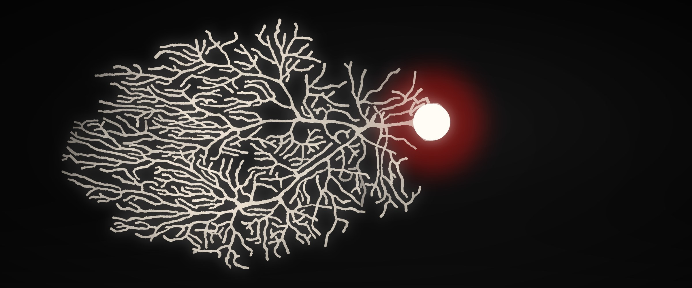
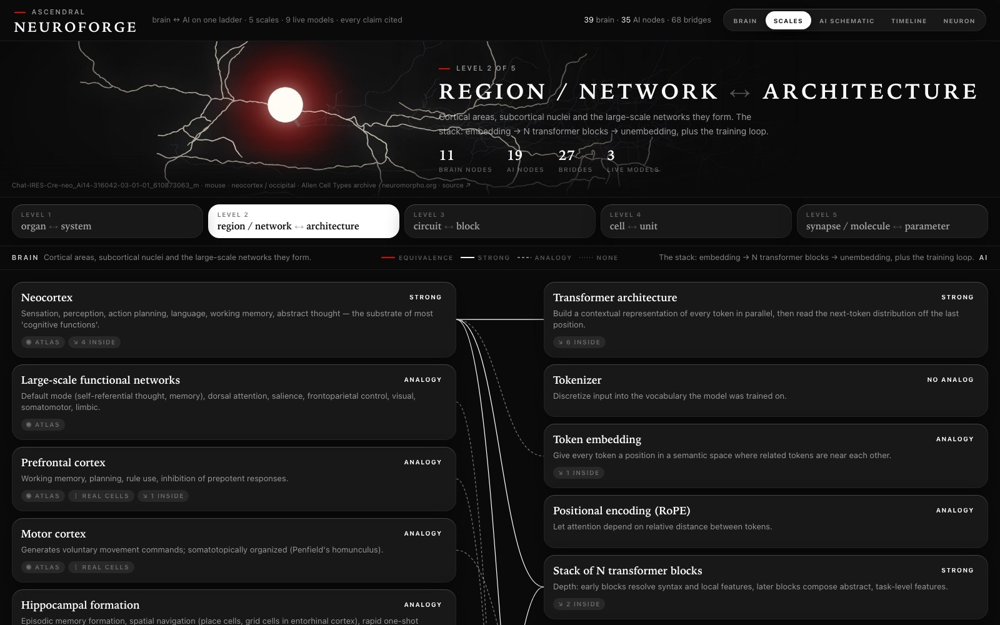

# NeuroForge

The human brain and a modern AI system on one ladder of scales — organ/system → region/architecture → circuit/block → cell/unit → synapse/parameter — with the bridge between them drawn at every rung and tagged by how much evidence backs it. Real atlases, real reconstructed neurons, live biophysical and computational models, every claim cited to a DOI that a script verifies. **Zero theater. Zero fake data. Zero placeholder responses.**



*Every image in NeuroForge is real data. This one is [Purkinje-slice-ageP35-4](https://neuromorpho.org/neuron_info.jsp?neuron_id=10071) — a mouse cerebellar Purkinje cell, Dusart archive via neuromorpho.org, doi:10.1523/JNEUROSCI.2977-12.2013 — rendered by [`scripts/render_heroes.py`](scripts/render_heroes.py) from its SWC reconstruction. No generative art anywhere in the project.*

Free open research by [Ascendral](https://ascendralsoftware.com). Runs locally — see [Local dev](#local-dev).

## What is in it

| View             | What you get                                                                                                                                                            |
| ---------------- | ----------------------------------------------------------------------------------------------------------------------------------------------------------------------- |
| **brain**        | fsaverage5 cortex + Harvard-Oxford / Pauli / Diedrichsen meshes, 120 real NeuroMorpho cells placed at atlas centroids, Yeo 7/17, Schaefer 100, DiFuMo 64, HCP-1065 tracts, 19 PET receptor maps, Allen gene expression, 35 cognitive functions |
| **scales**       | The ladder. Brain left, AI right, one rung at a time; analog links colored by evidence (equivalence / strong / analogy / none); click a node for what it is, what it does, how, numbers, sources, atlas anchors, real cells, and its live model |
| **ai schematic** | The complete AI side as one diagram: inference stack, exploded transformer block, augmentation (KV cache, RAG, MoE, in-context learning), training loop (loss, backprop, optimizer, regularization, RLHF, replay), units, parameters |
| **timeline**     | 72 landmark results 1921 → 2025 (neuro / AI / bridge), each DOI-verified and linked to the node it concerns                                                              |
| **neuron**       | Any NeuroMorpho reconstruction in 3D with the Hodgkin-Huxley model running on it                                                                                         |



*The scales view at rung 2 of 5: brain regions on the left, the transformer stack on the right, every bridge tagged `equivalence` / `strong` / `analogy` / `none` by the evidence behind it. Deep-link any view with `?view=scales|ai|timeline|neuron`.*

## Live models (all parameters cited)

| Model                          | Rung           | Source                                                        | What it shows                                                       |
| ------------------------------ | -------------- | ------------------------------------------------------------- | ------------------------------------------------------------------- |
| Hodgkin-Huxley (1952)          | synapse / cell | doi:10.1113/jphysiol.1952.sp004764                            | Na⁺/K⁺ action potential, Brian2                                     |
| Synapse kinetics               | synapse        | Destexhe 1994, Jahr & Stevens 1990                            | AMPA / NMDA / GABA-A currents; NMDA Mg²⁺ block and J-shaped I-V     |
| STDP (Bi & Poo 1998)           | synapse        | doi:10.1523/JNEUROSCI.18-24-10464.1998                        | timing window, Brian2 pair matches kernel                           |
| Hebbian + Oja (1949 / 1982)    | synapse        | Bliss & Lømo 1973, Oja 1982                                   | runaway vs normalized learning                                      |
| McCulloch-Pitts (1943)         | unit           | doi:10.1007/BF02478259                                        | threshold logic; XOR impossibility proof by exhaustive search       |
| Hubel-Wiesel V1 (1962)         | circuit        | doi:10.1113/jphysiol.1962.sp006837                            | Gabor simple cell, energy-model complex cell, tuning curve          |
| Hopfield (1982)                | circuit        | doi:10.1073/pnas.79.8.2554                                    | attractor recall, 0.138·N capacity                                  |
| **Modern Hopfield ≡ attention**| block          | Ramsauer 2021, Krotov & Hopfield 2016, Demircigil 2017        | update rule = softmax(βQKᵀ)V to 1e-12; capacity sweep vs classic    |
| **Dopamine RPE**               | circuit        | Schultz, Dayan & Montague 1997; Montague 1996; Sutton 1988    | the three canonical panels; δ moves from reward to cue with learning|

## Hard rules

- **100% real data.** Atlases from nilearn / OSF / Zenodo / GitHub releases of the original labs; neurons from neuromorpho.org via REST; receptor maps from the Hansen 2022 repository.
- **Every DOI resolves.** `scripts/verify_dois.py` checks every reference in `citations.py`, `data/scales.py` and `data/research_timeline.py` against Crossref, then DataCite. 128 / 128 at last run.
- **Evidence tags are enforced.** `equivalence` cannot be asserted without the Ramsauer proof attached; every node has a cross-side link or an explicit no-analog note; every anchor label must exist in the atlas (`tests/test_scales.py`).
- **Demo constants are declared.** Where a model's numbers are ours (e.g. the dopamine model's learning rate), the response carries a `parameter_note` saying so and saying which claims are the paper's.
- **No mocks.** Integration tests hit neuromorpho.org (skipped only if the network is down).

## Stack

- **Backend:** Python 3.12, FastAPI, Brian2 (CPU), NumPy/SciPy, nilearn/nibabel, SQLite
- **Frontend:** Next.js 14 (App Router), TypeScript strict, React 18, React Three Fiber + drei + Three.js, Tailwind
- **Monorepo:** pnpm workspaces

See [ARCHITECTURE.md](ARCHITECTURE.md).

## Local dev

```bash
cd backend && python3.12 -m venv .venv && source .venv/bin/activate && pip install -e '.[dev]'
uvicorn neuroforge_api.main:app --reload --port 8000
```

```bash
cd frontend && pnpm install && pnpm dev   # :3000
```

## API (selected)

| Endpoint                            | Method | Returns                                                            |
| ----------------------------------- | ------ | ------------------------------------------------------------------ |
| `/api/scales/graph`                 | GET    | levels, nodes (anchors resolved to MNI centroids), edges, strengths |
| `/api/scales/node/{id}`             | GET    | one node                                                           |
| `/api/research/timeline`            | GET    | 72 milestones, sorted                                              |
| `/api/simulate/modern-hopfield`     | POST   | modern vs classic recall on identical patterns + capacity sweep    |
| `/api/simulate/dopamine-rpe`        | POST   | δ(t) for the three Schultz 1997 conditions + learning curve        |
| `/api/simulate/synapse`             | POST   | AMPA/NMDA/GABA-A currents at a holding voltage + NMDA I-V          |
| `/api/simulate/{hh,stdp,v1,hebbian,hopfield,mcp}` | | the classic modules                                     |
| `/api/brain/*`                      | GET    | mesh, regions, functions, receptors, tracts, networks, parcels, nuclei, cerebellum, difumo, yeo17, hcp1065, allen-genes |
| `/api/neurons/*`                    | GET    | NeuroMorpho search + full SWC                                      |
| `/api/citations{,/bibtex}`          | GET    | module bibliography                                                |

Swagger at `http://localhost:8000/docs`.

## Tests and gates

```bash
cd backend && source .venv/bin/activate && pytest -q       # 116 tests
python scripts/verify_dois.py                              # every DOI, all registries
cd frontend && pnpm typecheck && pnpm lint
```

Audit logs per sprint live in `docs/audits/` — latest: [multiscale-ladder.md](docs/audits/multiscale-ladder.md).

## License

Code is [MIT](LICENSE). The datasets NeuroForge fetches (atlases, NeuroMorpho reconstructions, receptor maps, gene expression) remain under their original licenses and citation requirements — the app displays the source for each, and `citations.py` carries the full bibliography.
